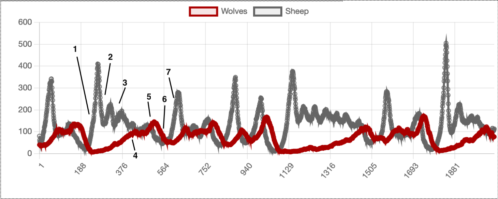

# Modèle proie prédateur

## Résumé

Nous avons conçu un modèle multi-agent pour simuler un système de proies (représentées par des moutons) et prédateurs (représentés par des loups).

L'objectif de ce modèle est d'observer des mécanismes de régulation pouvant se mettre en place, notamment

- Si le système peut s'équilibrer, le nombre de proies ou de prédateurs ne chutant jamais à 0
- Si les proies meurent en l'absence de prédateurs (en épuisant toutes les ressources)

## Hypothèses

A chaque pas de temps, une seule action est effectuée par les moutons ou les loups. Autrement dit, les agents peuvent soit se reproduire ou manger. Les moutons mangent de l'herbe et les loups mangent des moutons. Nous considérons que les moutons mangent toute l'herbe disponible lorsqu'ils se déplacent sur une cellule. L'herbe pousse à une certaine vitesse et les moutons peuvent la manger avant qu'elle n'ait complètement repoussée (cependant, ils obtiennent moins d'énergie en le faisant). Les loups et les moutons font des mouvements "intelligents", c'est-à-dire qu'un mouton n'ira pas dans une cellule où il y a un loup et se déplacera vers la cellule où il y a le plus de nourriture. La décision des moutons ou des loups de manger ou de se reproduire se fait en fonction des hormones et des variables de la faim. Après la reproduction, les hormones sont basses pour éviter les reproductions multiples et favoriser l'apport énergétique. Il en est de même pour la variable faim. De plus, un loup ne mangera pas un mouton s'il a un niveau d'énergie supérieur à un certain seuil n'ayant pas d'estomac extensible à l'infini. Nous avons considéré que cette règle n'est pas indispensable dans le cas des ageaux / agnelles.

Nous avons défini des genres pour les moutons et les loups. Ainsi, nous avons défini le bélier / la brebis et les loups / les louves. La reproduction ne se produit qu'avec une certaine probabilité lorsqu'un sexe féminin et masculin se rencontrent. Un(e) seul agneau(elle) ou louveteau est obtenu après la reproduction. Pour augmenter le réalisme, nous avons ajouté un paramètre d'âge. Le petit né avec un âge de 0. A chaque pas de temps, l'âge est augmenté de un. Les paramètres d'âge sont également utilisés pour fixer les limites d'âge et la probabilité de maladie. Plus le mouton vieillit, plus la probabilité qu'il meure est élevée avec une limite de 100 pas de temps. Passé un certain seuil, les agents mourront de vieillesse. Enfin, l'âge sert à fixer un âge minimal de reproduction (cette hypothèse empêche également qu'un enfant se reproduise immédiatement avec l'un de ses parents).

<!-- Si jamais on veut une version anlgaise .... At each time step, only one action is performed by the sheep or wolves (i.e. reproduce or eat). The sheep eat grass and wolves eat sheep. We consider that sheep eat all grass available when they moved on a cell. The grass grows with a certain speed and sheep can eat it before it is fully grown (however, they get less energy by doing so). Both wolves and sheep make "smart" moves, i.e. a sheep won't go on a cell where there is a wolf and will move to the cell where is the more food. The decision of sheep or wolves to eat or to reproduce is done according to the hormones and hunger variables. After reproduction, hormones are low to prevent multiple reproductions and favour energy intake. The same is true for the hunger variable. Also, a wolf won't eat a sheep if he has an energy level higher than a certain threshold as a  wolf does not have an infinitely expandable stomach. We considered that this rule isn't essential in the case of sheep.

We defined genders for sheep and wolves. Thus, we defined ram and ewe and wolves and she-wolves. Reproduction occurs only with a certain probability when a female and male gender meet. Only one cub is obtained after reproduction. To increase realism, we added an age parameter. The born cub has an age of 0. At each time step, the age is increased by one. The age parameters is also used to fix age limits and illness probability. The older becomes the sheep, the higher is the probability that he dies with a limit of 100 steps. After a certain threshold, agents will die from old age. Finally, the age is used to set a minimal reproduction age (this assumption also prevents that a cub immediately reproduces with one of his parents). -->

## Paramètres de la simulation

Nous avons modifié sensiblement les agents:

- Les moutons et les loups ont maintenant un **sexe**, et ils doivent trouver un partenaire du sexe opposé pour s'accoupler.
- Les moutons et les loups ont un **âge** : ils prennent un certain temps à atteindre l'âge adulte, et plus ils sont vieux et plus ils ont de chance de mourir de maladie ou de vieillesse.
- Les loups et les moutons **se dirigent intelligemment** en regardant le contenu des cases à côté d'eux à tout instant.
- Les loups ont une notion de **faim** ; les loups et les moutons ont une notion d'**hormones**. Celles-ci influent leur comportement, pour que par exemple un animal ne s'étant pas accouplé depuis longtemps cherche avant tout un partenaire (par rapport à la nourriture), et inversement.
- Les moutons peuvent **manger l'herbe même si elle n'a pas entièrement poussé**. Dans ce cas, ils ne récupèreront qu'une partie de l'énergie d'une herbe qui a fini de pousser.

## Implémentation

La structure de fichiers n'a pas changé.

Les différentes actions possibles des agents ont par contre été séparées dans différentes méthodes, notamment pour les moutons et les loups:

- La méthode `step` est la méthode principale d'update. Elle appelle les actions possibles.
- La méthode `choose_move` permet aux individus de choisir la case pour le prochain déplacement.
- La méthode `reproduce`, couplée avec la méthode `can_reproduce_with`, leur permettent de se reproduire.
- La méthode `update_energy` leur permet de manger.
- La méthode `die_from_age_or_illness` permet de simuler la mort par vieillesse et maladie.

## Lancer la simulation

Pour lancer la simulation, il suffit d'utiliser la commande suivante:

```bash
python run.py
```

## Results

Nous avons effectué plusieurs expérience afin de trouver l'ensemble de paramètres résultant en un équilibre des populations de moutons et de loups.

- La grille, i.e. l'environnement de simulation, utilisé a une taille de 30x30.
- Nous initialisons alétaoirement la grille en y plaçant 80 moutons et 40 loups.
- Le taux de reproduction des moutons est considéré plus élévé chez les moutons que chez les loups avec 0.25 contre 0.03 respectivement.
- Lorsque l'herbe est mangée par les moutons, elle prend 30 étapes pour repousser complètement et offre un énergie totale de 4 points lorsqu'elle est à son maximum.
- Moutons et loups commencent avec une énergie totale de 6 points et perdent un point d'énergie par étape.
- Un loup qui mange un mouton en retire 20 points d'énergie et ne mangera plus de moutons jusqu'à avoir atteint un minimum d'énergie de 10 points.
- Les loups et moutons sont considérés comme adultes (et peuvent donc se reproduire) à partir de 5 unités de temps.
- La longétivité maximale d'un mouton et loup est de 200 unités de temps.
- A partir de 100 unités de temps, les loups et moutons peuvent attraper des maladies et en mourir avec une probabilité $\frac{1}{200- age}$.



Nous remarquons que le même phénomène se répète périodiquement :

1. Quand le nombre de moutons est assez bas, il augmente fortement. En effet, il y a beaucoup d'herbe disponible pour très peu de moutons qui vont donc avoir tendance à plus se reproduire qu'à mourir.
2. Ce pic va ensuite diminuer fortement. Il n'y a plus assez d'herbe pour tout le monde, les moutons vont mourir en masse.
3. Il va se stabiliser à un nombre assez élevé de moutons (bien que marqué par des pics moins importants liés aux phénomènes indiqués précédemment).
4. En parallèle, le nombre de loups augmente progressivement. En effet, il y a suffisamment de moutons pour qu'ils n'aient aucun problème de nourriture.
5. Le nombre de loups va alors dépasser celui des moutons, qui meurent plus sous les machoires des loups qu'ils ne se reproduisent.
6. Comme il y a très peu de moutons par rapport à la population de loups, celle-ci va décroître rapidement.
7. Il reste suffisamment de moutons, qui ne sont alors plus sous la menace des loups et qui peuvent par conséquent croître très vite : nous sommes revenus à l'étape 1.

Nous avons également simulé la disparition d'une des deux espèces. Dans le cas où il n'y a plus de moutons, la population de loup disparait bien après quelques itérations puisqu'ils n'ont plus rien à manger. Dans le cas de la disparation des loups, nous observons une variation sinusoïdale de la population de moutons.

## Annexe : représentation des agents

Nous avons choisi de représenter les différents agents à l'aide des images suivantes:

- Les loups\
   
- Les louves\
   
- Les béliers\
   
- Les brebis\
   
- L'herbe (haute à gauche, broutée à droite)\
   

Les petits des loups et des moutons sont juste représentés de taille moins grande que les adultes.\
 

Sur l'affichage, nous pouvons voir les éléments suivants:

- La **barre supérieure** présentant le modèle et permettant de le démarrer, de le stopper et de le mettre à zéro
- La **grille** avec les agents
- Les **paramètres du modèles**, que l'on peut modifier
- Un **graph** présentant la répartition des loups et des moutons au cours du temps\
  \
