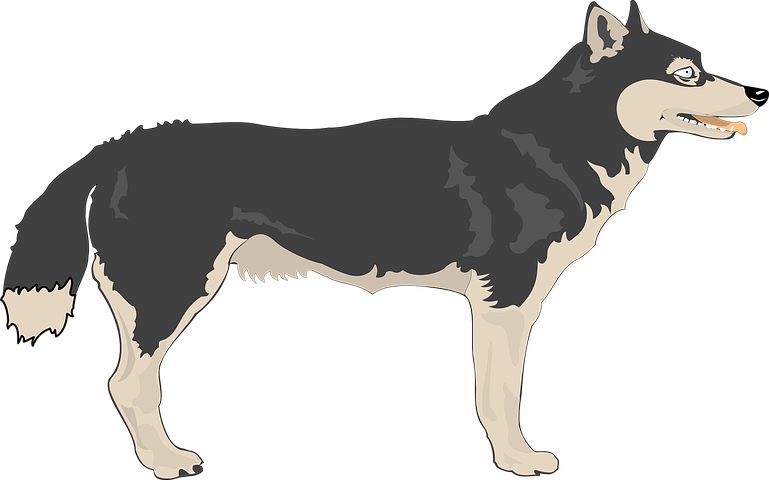
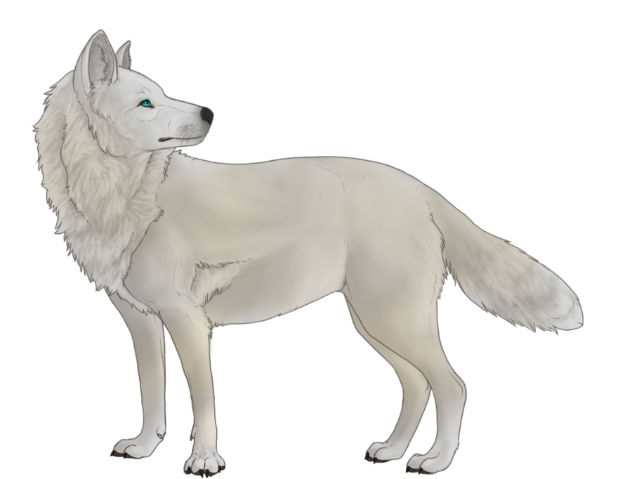
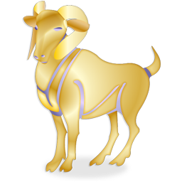
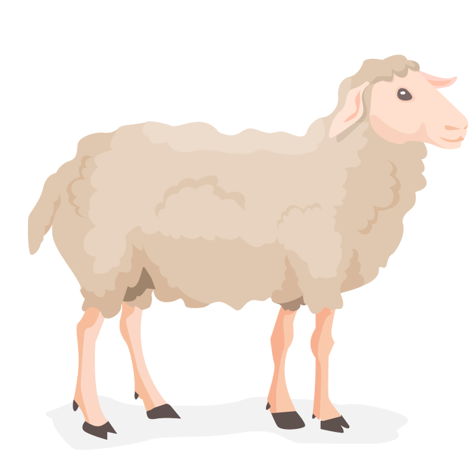
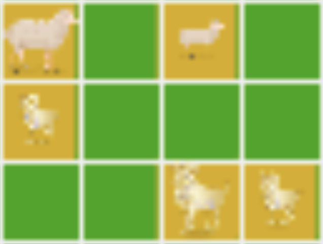
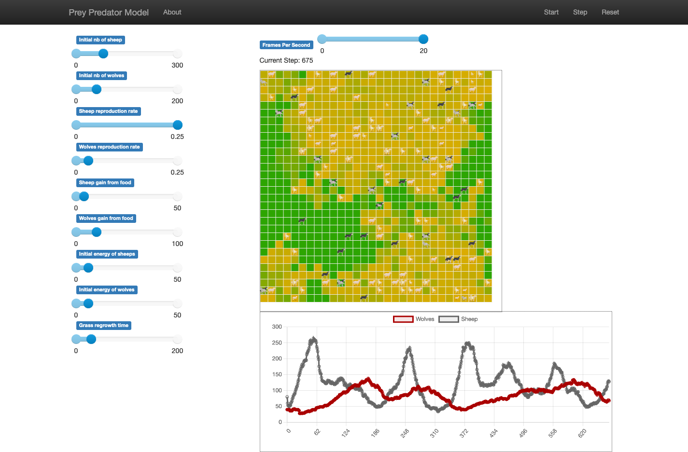

# Modèle proie prédateur

## Résumé

Nous avons conçu un modèle multi-agent pour simuler un système de proies (représentées par des moutons) et prédateurs (représentés par des loups).

L'objectif de ce modèle est d'observer des mécanismes de régulation pouvant se mettre en place, notamment

- Si le système peut s'équilibrer, le nombre de proies ou de prédateurs ne chutant jamais à 0
- Si les proies meurent en l'absence de prédateurs (en épuisant toutes les ressources)

## Paramètres de la simulation

Nous avons modifié sensiblement les agents:

- Les moutons et les loups ont maintenant un **sexe**, et ils doivent trouver un partenaire du sexe opposé pour s'accoupler.
- Les moutons et les loups ont un **âge** : ils prennent un certain temps à atteindre l'âge adulte, et plus ils sont vieux et plus ils ont de chance de mourir de maladie ou de vieillesse.
- Les loups et les moutons **se dirigent intelligemment** en regardant le contenu des cases à côté d'eux à tout instant.
- Les loups ont une notion de **faim** ; les loups et les moutons ont une notion d'**hormones**. Celles-ci influent leur comportement, pour que par exemple un animal ne s'étant pas accouplé depuis longtemps cherche avant tout un partenaire (par rapport à la nourriture), et inversement.
- Les moutons peuvent **manger l'herbe même si elle n'a pas entièrement poussé**. Dans ce cas, ils ne récupèreront qu'une partie de l'énergie d'une herbe qui a fini de pousser.

## Implémentation

La structure de fichiers n'a pas changé.

Les différentes actions possibles des agents ont par contre été séparées dans différentes méthodes, notamment pour les moutons et les loups:

- La méthode _step_ est la méthode principale d'update. Elle appelle les actions possibles.
- La méthode _choose_move_ permet aux individus de choisir la case pour le prochain déplacement.
- La méthode _reproduce_, couplée avec la méthode _can_reproduce_with_, leur permettent de se reproduire.
- La méthode _update_energy_ leur permet de manger.

## Affichage

Nous avons choisi de représenter les différents agents à l'aide des images suivantes:

- Les loups\
   
- Les louves\
   
- Les béliers\
   
- Les brebis\
   
- L'herbe (haute à gauche, broutée à droite)\
   

Les petits des loups et des moutons sont juste représentés de taille moins grande que les adultes.\

Sur l'affichage, nous pouvons voir les éléments suivants:

- La **barre supérieure** présentant le modèle et permettant de le démarrer, de le stopper et de le mettre à zéro
- La **grille** avec les agents
- Les **paramètres du modèles**, que l'on peut modifier
- Un **graph** présentant la répartition des loups et des moutons au cours du temps

#

## Résultats
